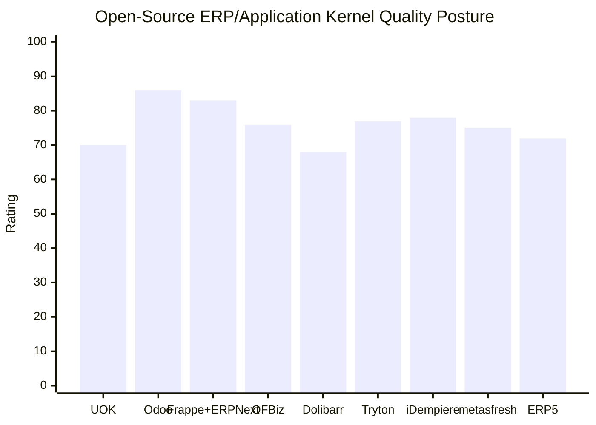
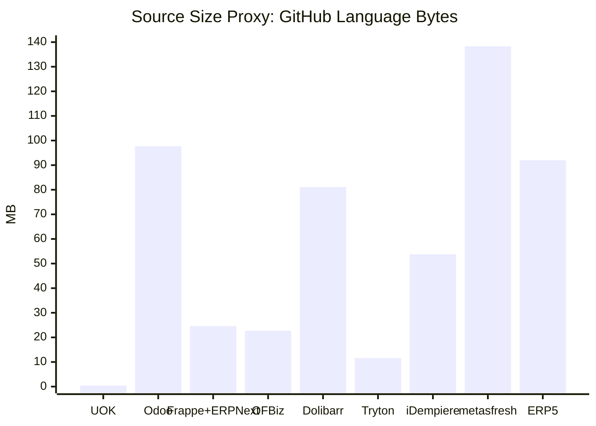

# UOK Open-Source ERP Kernel Quality Rating Chart

**Assessment date:** 2026-07-06
**UOK build assessed:** `UOK-3.1.0-alpha.2` local candidate
**Scope:** UOK compared with mature open-source ERP/application-kernel systems using public source repositories and local UOK source inspection.

This chart is a code-level architecture comparison, not a feature checklist and not a market ranking. It compares maintainability posture, kernel design, folder structure, module model, verification posture, security/governance posture, and maturity.

## Method

UOK was measured from the local source tree after the module-extension baseline. Peer size and folder-structure data were collected from public GitHub repository metadata and root repository listings. GitHub language byte counts are used as a source-size proxy because they are available consistently across open-source repositories. They are not exact executable kernel size.

The rating scale is `0-100`:

- `90-100`: mature, cleanly bounded, proven platform kernel with strong module ecosystem and operations model.
- `80-89`: mature and architecturally strong, with complexity that is still manageable.
- `70-79`: mature or promising, but with material complexity, legacy structure, or weaker governance boundaries.
- `60-69`: useful or promising, but incomplete as a production-grade platform kernel.
- `<60`: not yet comparable as a stable kernel.

## Current UOK Size Baseline

| Metric | Current UOK |
|---|---:|
| Non-generated source files scanned | `144` |
| Non-generated source lines scanned | `8,847` |
| Non-generated source bytes | `0.404 MB` |
| Largest non-generated implementation file | `176` lines |
| Largest documentation artifact | `405` lines |
| Main source roots | `src/uok`, `modules`, `web/src`, `tests`, `scripts`, `docs`, `migrations` |
| Current kernel module posture | `apps.manager` required, `contacts.core` optional/installable with file-backed manifests and manifest-declared runtime surfaces |

This is excellent for reviewability, but it also means UOK is still an early kernel. The score must therefore separate **size discipline** from **platform maturity**.

## ERP-Focused Peer Quality Chart

## Source Size Comparison

Lower size is not automatically better. Mature ERP systems are larger because they include years of domain modules, migrations, tests, integrations, UI assets, and operational packaging.

## Comparable Rating Table

| System | Source-level access | Source size proxy | Folder / kernel shape | Strongest qualities | Main weakness compared with ideal UOK target | Rating |
|---|---:|---:|---|---|---|---:|
| UOK | Local full source | `0.40 MB`, `8.8k LOC` | `src/uok` kernel, top-level `modules/`, `web/src`, `tests`, `scripts`, focused implementation files under `200` lines | Very clean current size, explicit language policy, file-backed module manifests, manifest-declared runtime extension surfaces, Apps Manager, optional Contacts module, local verifier, PostgreSQL 18 runtime | Early maturity, only one capability module, module-specific React source/migrations/pytest suites still partly top-level, limited production IAM and multi-tenant hardening | `70` |
| Odoo | Public source | `97.7 MB` | `odoo/` core plus large `addons/` app ecosystem | Best open-source example of installable business apps that can work standalone and together | Very large codebase, high upgrade/customization discipline required | `86` |
| Frappe + ERPNext | Public source | `24.6 MB` combined | `frappe/` framework plus `erpnext/` application suite | Metadata-driven framework, strong app model, good developer ergonomics, ERPNext business depth | Framework and app suite are split across repos; deep customization can become metadata-heavy | `83` |
| Apache OFBiz | Public source | `22.7 MB` | `framework/`, `applications/`, `themes/`, service/entity/widget model | Strong separation of framework and enterprise applications; mature service/entity concepts | Java/XML/Groovy stack is heavier and harder for modern UI iteration | `76` |
| Dolibarr | Public source | `81.1 MB` | `htdocs/`, `dev/`, `scripts/`, `test/` | Broad ERP/CRM coverage, practical deployment history, strong SMB usefulness | Less clean as a kernel reference; PHP web-app structure is more application-centric than platform-kernel-centric | `68` |
| Tryton | Public source | `11.6 MB` | `modules/`, `trytond/`, `tryton/`, `sao/`, `proteus/` | Clean modular ERP architecture, strong Python orientation, compact compared with Odoo/Dolibarr | Smaller ecosystem and lower GitHub visibility; UI/business breadth is less visible than Odoo/ERPNext | `77` |
| iDempiere | Public source | `53.8 MB` | Many OSGi-style `org.*` plugin roots, `db/`, `migration/`, UI/server modules | Strong plugin architecture, ERP/CRM/SCM depth, long-lived business logic lineage | Root structure is very fragmented; Java/OSGi complexity raises maintenance burden | `78` |
| metasfresh | Public source | `138.3 MB` | `backend/`, `frontend/`, `distribution/`, `docker-builds/`, `e2e/` | Clear backend/frontend split, Docker-oriented packaging, React UI, strong manufacturing/trade ERP focus | Largest source proxy in this set; monorepo scale requires strong ownership discipline | `75` |
| ERP5 | Public source mirror | `92.0 MB` | `bt5/`, `erp5/`, `product/`, `slapos/`, `tests/`, `wendelin/` | Long-lived ERP/CRM/KM platform with business-template style organization | Smaller public GitHub activity signal; architecture is less immediately approachable for new contributors | `72` |

## Score Breakdown

| System | Size discipline | Architecture design | Folder clarity | Module model | Verification / ops | Security / governance | Maturity | Overall |
|---|---:|---:|---:|---:|---:|---:|---:|---:|
| UOK | `9.5` | `7.4` | `8.8` | `7.6` | `7.2` | `6.1` | `3.0` | `70` |
| Odoo | `5.5` | `9.0` | `8.0` | `9.5` | `8.0` | `8.0` | `9.5` | `86` |
| Frappe + ERPNext | `7.0` | `8.5` | `8.0` | `8.5` | `8.0` | `8.0` | `8.5` | `83` |
| Apache OFBiz | `6.5` | `8.0` | `7.5` | `8.0` | `7.5` | `7.0` | `8.0` | `76` |
| Dolibarr | `5.5` | `6.5` | `6.0` | `7.0` | `6.5` | `6.5` | `8.0` | `68` |
| Tryton | `8.0` | `8.0` | `8.0` | `8.0` | `7.0` | `7.0` | `7.0` | `77` |
| iDempiere | `6.0` | `8.0` | `6.5` | `8.5` | `7.5` | `7.5` | `8.5` | `78` |
| metasfresh | `5.0` | `8.0` | `7.5` | `7.5` | `8.0` | `7.5` | `8.0` | `75` |
| ERP5 | `5.5` | `7.5` | `7.0` | `7.5` | `7.0` | `7.0` | `7.5` | `72` |

## Interpretation for UOK

UOK is not yet competitive with Odoo, Frappe/ERPNext, OFBiz, Tryton, iDempiere, metasfresh, or ERP5 as a mature ERP platform. It is competitive only in **current source cleanliness**, **reviewability**, and **architecture discipline**.

The gap is clear:

1. UOK has the right architectural direction: modular monolith, installable modules, product-neutral core, explicit language policy, generated API contracts, manifest-declared runtime surfaces, and local verification.
2. UOK lacks mature ERP depth: accounting, inventory, procurement, sales, workflow, documents, reporting, audit dashboards, module marketplace, and production-grade tenant/security model.
3. UOK should not copy peer code. It should adopt peer-proven patterns:
   - Odoo: installable app catalog, manifest discipline, broad module ecosystem.
   - Frappe/ERPNext: metadata-driven business objects, permissions, workflows, app framework ergonomics.
   - OFBiz: service/entity separation and explicit business service contracts.
   - Tryton: compact modular ERP organization and Python-based module packaging discipline.
   - iDempiere: plugin lifecycle and extension isolation.
   - metasfresh: backend/frontend separation, Docker packaging, e2e release discipline.
   - ERP5: business-template packaging and long-lived process/business-object modeling.

## UOK Target Rating Path

| Target stage | Expected rating | Required evidence |
|---|---:|---|
| Current local candidate | `70` | Apps Manager, Contacts, source under `200` lines, file-backed module manifests, manifest-declared runtime surfaces, verifier passing |
| After Contacts + CRM Basic + Products + Cargo Transactions | `72-75` | Real module relationships, reusable product/cargo separation, install/uninstall/upgrade evidence |
| After accounting-lite, inventory-lite, documents, workflow, reporting | `78-82` | Multi-module ERP transaction coverage and repeatable migrations |
| After production IAM, tenant isolation, restore drills, CI, module marketplace | `83-86` | Comparable kernel governance to mature open-source peers |
| Mature UOK ecosystem | `86+` | Third-party modules, stable extension APIs, upgrade compatibility, broad test matrix |

## Design Conclusion

UOK should continue as a **small, strict modular monolith kernel** and avoid becoming a large ERP monolith too early. Mature systems prove that module ecosystems win, but they also show how quickly platform code becomes hard to govern. UOK's advantage is that it can adopt the best patterns while keeping file size, folder boundaries, language stack, module manifests, extension surfaces, and verification gates disciplined from the beginning.

## Sources

- UOK local source scan: `C:\Users\vasan\OneDrive\Documents\UOK`, measured 2026-07-06.
- Odoo GitHub repository: https://github.com/odoo/odoo
- Frappe Framework GitHub repository: https://github.com/frappe/frappe
- ERPNext GitHub repository: https://github.com/frappe/erpnext
- Apache OFBiz Framework GitHub repository: https://github.com/apache/ofbiz-framework
- Dolibarr GitHub repository: https://github.com/Dolibarr/dolibarr
- Tryton GitHub repository: https://github.com/tryton/tryton
- iDempiere GitHub repository: https://github.com/idempiere/idempiere
- metasfresh GitHub repository: https://github.com/metasfresh/metasfresh
- ERP5 GitHub repository mirror: https://github.com/Nexedi/erp5
