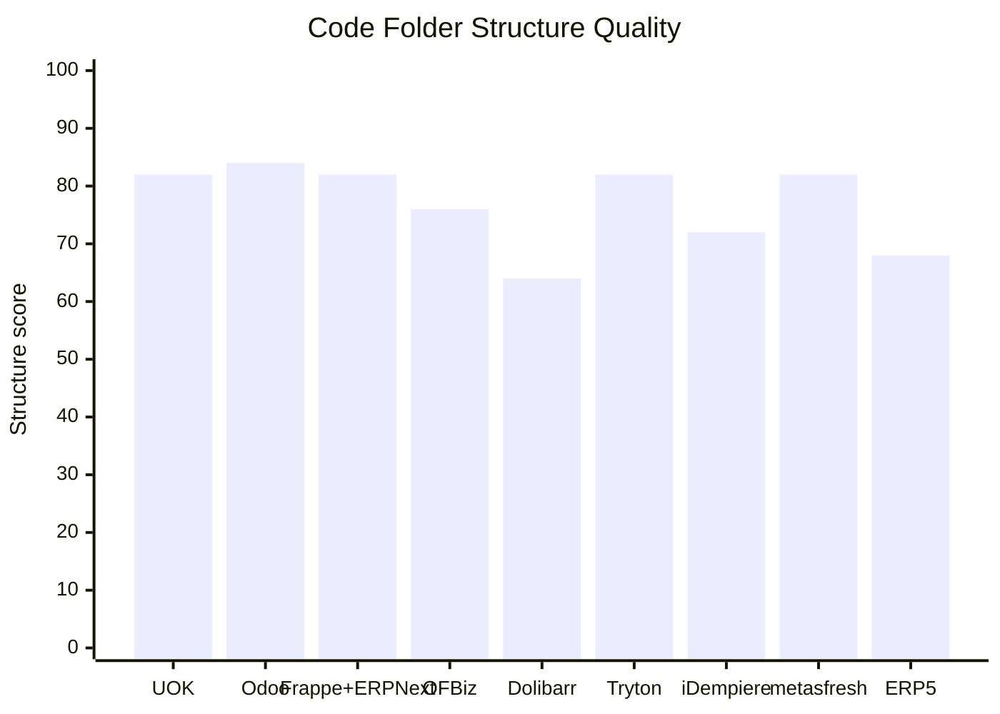

# UOK Peer Code Folder Structure Comparison

**Assessment date:** 2026-07-06
**UOK build assessed:** `UOK-3.1.0-alpha.2` local candidate
**Scope:** UOK compared with mature open-source ERP/application-kernel repositories at the code-folder structure level.

This document compares folder structure only. It should be read together with `UOK_OPEN_SOURCE_ERP_QUALITY_RATING_CHART.md`.

## Current UOK Structure

UOK currently uses a compact UOK-first structure:

```text
UOK/
  .github/
  deploy/
  docs/
    architecture/
    design/
    modules/
  migrations/
  modules/
    apps.manager/
      manifest.yaml
      backend/
      web/
      migrations/
      tests/
    contacts.core/
      manifest.yaml
      backend/
      web/
      migrations/
      tests/
  scripts/
    verify/
  src/
    uok/
      api/
      static/
      *.py
  tests/
  web/
    src/
      app/
      features/
        modules/
      generated/
      shared/
      styles/
```

Important current qualities:

- Kernel code is centralized under `src/uok`.
- API routes are split under `src/uok/api`.
- Frontend source is clearly under `web/src`.
- Frontend concerns are already split into `app`, `features`, `shared`, `styles`, and generated API contracts.
- Shared verification helpers live under `scripts/verify`; module runtime and release verifiers live under `modules/<module>/verify`.
- Tests are split by behavior area.
- Docs contain active architecture, design, module, rating, and policy guardrails.
- File-backed module manifests now live under top-level `modules/<module_name>`.
- `contacts.core` backend implementation now lives under `modules/contacts.core/backend/uok_contacts_core`.
- The module extension contract now validates ownership paths, API prefixes, permissions, owned tables, extension points, data-retention policy, backend import targets, owned model exports, and module-declared candidate verifier scripts.
- `contacts.core` commands, command permissions, role grants, dashboard counts, baseline evidence checks, model exports, API router, and candidate verifier scenario are manifest-declared runtime surfaces.
- The frontend shell now has a compile-time module surface registry under `web/src/features/modules`.

Important current limitation:

- UOK now has a physical module source root and manifest-declared backend runtime surfaces. Module-specific React source and pytest suites are still partly bridged from top-level folders; the next maturity step is moving more UI, migrations, and behavior tests behind each module root while keeping shared shell/kernel code in shared locations.

## Peer Folder Patterns

| System | High-level folder shape | What the structure teaches UOK |
|---|---|---|
| Odoo | `odoo/` core plus `addons/` app modules | Strong model for a small core plus a large installable app ecosystem. UOK should adopt the separation idea, not the full complexity. |
| Frappe + ERPNext | `frappe/` framework repo plus `erpnext/` application repo | Strong framework/application split. UOK can eventually separate kernel and business modules while keeping local development simple. |
| Apache OFBiz | `framework/`, `applications/`, `themes/`, `config/`, `runtime/` | Clear framework versus business-app separation. UOK should emulate this boundary more than the Java/XML implementation style. |
| Dolibarr | `htdocs/`, `dev/`, `doc/`, `scripts/`, `test/` | Practical web-app packaging, but less ideal as a kernel folder model because the web root dominates the structure. |
| Tryton | `trytond/`, `tryton/`, `modules/`, `sao/`, `proteus/` | One of the cleanest ERP folder patterns for UOK to learn from: server core, client, modules, tooling. |
| iDempiere | Many `org.*` plugin roots plus `db/`, `migration/`, `doc/` | Strong plugin isolation and lifecycle pattern, but root folder count is high and harder for review. |
| metasfresh | `backend/`, `frontend/`, `distribution/`, `docker-builds/`, `docs/`, `e2e/` | Clear modern full-stack monorepo separation. Good reference for UOK packaging, e2e tests, and frontend/backend ownership. |
| ERP5 | `bt5/`, `erp5/`, `product/`, `slapos/`, `tests/`, `wendelin/` | Business-template style packaging. Useful for future UOK module templates and product verticals. |

## Structural Quality Matrix

Scores are structural only, not total platform maturity.

| System | Core isolation | Module/app isolation | Frontend/backend separation | Test/ops separation | Contributor clarity | Structure score |
|---|---:|---:|---:|---:|---:|---:|
| UOK current | `8` | `8` | `8` | `8` | `9` | `82` |
| Odoo | `9` | `10` | `7` | `8` | `8` | `84` |
| Frappe + ERPNext | `9` | `8` | `8` | `8` | `8` | `82` |
| Apache OFBiz | `9` | `8` | `6` | `8` | `7` | `76` |
| Dolibarr | `6` | `7` | `5` | `7` | `7` | `64` |
| Tryton | `9` | `9` | `8` | `7` | `8` | `82` |
| iDempiere | `8` | `9` | `6` | `8` | `5` | `72` |
| metasfresh | `8` | `7` | `9` | `9` | `8` | `82` |
| ERP5 | `7` | `8` | `6` | `7` | `6` | `68` |



## UOK Compared Directly With Odoo

Odoo has the clearest mature pattern for UOK's intended direction:

```text
Odoo/
  odoo/       core framework
  addons/     installable business apps
  doc/
  setup/
```

Current UOK:

```text
UOK/
  src/uok/    kernel and compatibility facades
  modules/    file-backed installable module packages
  web/src/    React UI source
  docs/       policies and module plans
  tests/      behavior tests
  scripts/    verification and packaging scripts
```

The difference is important:

- Odoo has a mature physical add-on boundary.
- UOK now has a physical module boundary, manifest loader, manifest-declared backend runtime surfaces, and a frontend module surface registry.
- UOK should deepen that boundary by moving more module-owned UI, migrations, and behavior tests behind each module before adding many more modules.

## Recommended UOK Target Structure

For the next serious module expansion, UOK should continue toward this structure:

```text
UOK/
  src/
    uok/
      api/
      core/
      kernel/
      security/
      module_registry/
      static/
  modules/
    apps.manager/
      manifest.yaml
      backend/
      web/
      migrations/
      tests/
    contacts.core/
      manifest.yaml
      backend/
      web/
      migrations/
      tests/
    crm.basic/
      manifest.yaml
      backend/
      web/
      migrations/
      tests/
    products.core/
      manifest.yaml
      backend/
      web/
      migrations/
      tests/
    cargo.transactions/
      manifest.yaml
      backend/
      web/
      migrations/
      tests/
  web/
    src/
      app/
      shell/
      shared/
      generated/
      styles/
  docs/
  migrations/
  scripts/
  tests/
  deploy/
```

The core idea:

- `src/uok` should become kernel-only.
- `modules/<module_name>` should hold installable business capabilities.
- Each module should own its manifest, backend handlers, permissions, role grants, dashboard/evidence providers, model/table declarations, UI surface, migrations, tests, and candidate verifier scenarios.
- Shared UI and shared backend contracts should stay in kernel/shared folders only when genuinely reusable.
- Product-specific modules must not enter the kernel.

## Best Peer Lessons for UOK

1. Adopt from Odoo:
   - Physical add-on/module folder boundary.
   - Module manifests as first-class installation metadata.
   - Apps Manager as the human-facing module catalog.

2. Adopt from Tryton:
   - Compact server-core plus modules structure.
   - Python-oriented module discipline.
   - Clear separation between server, client, and modules.

3. Adopt from Frappe/ERPNext:
   - Framework/application separation.
   - Metadata-driven forms, permissions, and workflows.
   - Business app development that does not rewrite the framework.

4. Adopt from OFBiz:
   - Explicit service/entity boundaries.
   - Business applications separated from framework mechanics.

5. Adopt from iDempiere:
   - Plugin lifecycle thinking.
   - Extension isolation.
   - Database migration discipline per module.

6. Adopt from metasfresh:
   - Backend/frontend separation.
   - Docker/e2e packaging discipline.
   - Strong distribution folder ownership.

7. Adopt from ERP5:
   - Business-template packaging concept.
   - Long-lived business-object modeling.

## Conclusion

UOK's current folder structure is cleaner and easier to review than most mature ERP repositories because it is still small. The main structural improvement from this pass is that UOK now has a physical module source root with file-backed manifests and manifest-declared module runtime surfaces.

Before UOK adds CRM Basic, Products, Cargo Transactions, Accounting, Inventory, or Documents, the kernel should keep enforcing `modules/<module_name>` packaging and move more module-specific UI, migrations, and behavior tests under those module roots. That keeps UOK moving from a small modular monolith toward a mature ERP/application kernel without turning the core into a large mixed-responsibility monolith.

## Sources

- UOK local source tree: `C:\Users\vasan\OneDrive\Documents\UOK`
- UOK quality chart: `docs/architecture/UOK_OPEN_SOURCE_ERP_QUALITY_RATING_CHART.md`
- Odoo: https://github.com/odoo/odoo
- Frappe Framework: https://github.com/frappe/frappe
- ERPNext: https://github.com/frappe/erpnext
- Apache OFBiz Framework: https://github.com/apache/ofbiz-framework
- Dolibarr: https://github.com/Dolibarr/dolibarr
- Tryton: https://github.com/tryton/tryton
- iDempiere: https://github.com/idempiere/idempiere
- metasfresh: https://github.com/metasfresh/metasfresh
- ERP5: https://github.com/Nexedi/erp5
