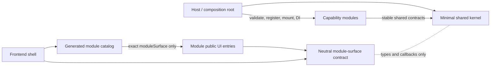

# Kernel, Host, And Frontend Shell Gap 3 Inventory – 2026-07-16

**Status:** Pre-refactor cycle and responsibility inventory.

**Current candidate:** `UOK-3.1.0-alpha.3`

## Purpose

Record the actual backend composition, ORM bootstrap, session wiring, frontend
shell ownership, Contacts backedges, and effective dependency cycles before the
focused Gap 3 refactor. This inventory is based on branch
`feature/planning-flow-board` at commit
`6dad7d59f1134807b4e33bd7bf7094f0b855f6d3`.

Gap 1 and Gap 2 are fixed inputs to this work. Planning still consumes
Contacts, Reports, Calendar, and Communications only through owner public DTO
APIs, and Planning/Contacts retain their exact seven/eight-symbol Python
facades. This inventory does not propose a module split or facade expansion.

`pre-gap3:` identifies an exact repository path at the recorded inventory
commit. The implementation step may deliberately remove that path.

## A. Current Responsibility Placement

### Backend

| Responsibility | Current placement | Current behavior | Boundary assessment |
|---|---|---|---|
| FastAPI application creation, lifespan, static mount, exception handlers, global routers, and module router mount | `pre-gap3:src/uok/main.py` | Validates manifests and registers every module ORM mapping at import time, constructs `app`, mounts global routers, and dynamically mounts module routers. | Host/composition-root work is mixed into the package described as the kernel. |
| ORM engine, pool, session factory, request dependency, and declarative base | `pre-gap3:src/uok/db.py`, `pre-gap3:src/uok/db_pool.py` | Creates the engine and `SessionLocal` at import time; `Base` is shared by kernel and module mappings; feature HTTP adapters import `get_db`. | Engine/session ownership is host infrastructure, while the stable declarative base is a shared persistence contract. They are not separated. |
| Manifest-only ORM registration | `pre-gap3:src/uok/module_model_registry.py` | After static manifest validation, dynamically imports every declared `model_exports` provider and mutates the single `Base` registry before schema/migration inspection. | Correct mechanism, wrong owner: this is composition-root bootstrap, not a universal kernel concern. |
| Global ORM compatibility graph | `pre-gap3:src/uok/models.py`, plus `pre-gap3:src/uok/calendar_models.py` and `pre-gap3:src/uok/communication_models.py` | Calls module registration during import and exposes all registered mapped classes through one global module. | A compatibility backdoor crosses data-owner boundaries and makes model bootstrap reachable from ordinary shared imports. Gap 1/2 tests currently block the most dangerous Planning/Contacts uses, but the surface still exists. |
| Module backend path mutation and dynamic provider resolution | `pre-gap3:src/uok/module_paths.py`, `pre-gap3:src/uok/module_imports.py` | Adds validated module backend roots to `sys.path`, imports provider targets, and verifies their source origins. | Privileged host/plugin loading is stored alongside stable shared code. |
| Router, command, role-grant, dashboard, and evidence provider composition | `pre-gap3:src/uok/module_routers.py`, `pre-gap3:src/uok/module_commands.py`, `pre-gap3:src/uok/module_policy.py`, `pre-gap3:src/uok/module_reports.py` | Dynamically resolves module-declared hooks and merges them into the running application. | These files are host registries/adapters, not shared domain contracts. |
| Auth and request-session wiring | `src/uok/security.py`, `src/uok/api/auth.py`, `src/uok/api/commands.py`, `src/uok/api/system.py` | FastAPI dependencies use `uok.db.get_db`; security lazily loads module role grants; system APIs merge module dashboard/evidence providers. | Stable auth/authorization behavior is shared, but request DI and module-provider aggregation point back into composition concerns. |
| Kernel ORM mappings | `src/uok/kernel_models.py` | Owns nine product-neutral organization, identity, governance, lifecycle, workflow, command-log, and event mappings. | The mappings are product-neutral, but they import `Base` from the mixed engine/session module. |
| Module-owned ORM mappings | `modules/*/backend/<package>/**/models.py` and manifest `model_exports` | Owners define capability mappings and expose a privileged model list/provider for host registration. Planning and Contacts keep that provider below `_internal.persistence`. | Physical ownership is correct. The host-facing bootstrap SPI is intentionally not a business facade and must remain owner-local. |

The dynamic host-to-module import points are:

- `pre-gap3:src/uok/module_model_registry.py:124` → each manifest `model_exports`;
- `pre-gap3:src/uok/module_routers.py:37` → each `api_router`;
- `pre-gap3:src/uok/module_commands.py:26,51,75` → command handlers,
  permissions, and replay guards;
- `pre-gap3:src/uok/module_policy.py:15` → role grants;
- `pre-gap3:src/uok/module_reports.py:17,32` → dashboard and evidence providers.

### Frontend

| Responsibility | Current placement | Current behavior | Boundary assessment |
|---|---|---|---|
| Shell entry, authentication, layout, navigation, appearance, locale, and account chrome | `web/src/App.tsx`, `web/src/app/*`, `web/src/features/auth`, `web/src/features/layout` | `App` calls one broad `useWorkbench()` and passes the returned object into the module surface registry. | Shell ownership is broader than layout/nav/auth because `useWorkbench` also owns Contacts data, state, preferences, and commands. |
| Module discovery and loading | `web/src/generated/moduleSurfaceCatalog.ts`, `web/src/features/modules/moduleSurfaceRegistry.tsx` | Generated literal imports register five module surface entries at build time. | The generated catalog is the correct composition point, but its contract imports the concrete shell `Workbench` type. |
| Module surface contract | `pre-gap3:web/src/features/modules/moduleSurfaceContract.ts` | `ModuleSurfaceHostContext` is an alias for the entire `Workbench` return type. | The contract is shell-owned and exposes roughly 100 fields, most of them Contacts-specific. It is not a stable port. |
| Contacts public UI entry | `modules/contacts.core/web/src/moduleSurface.tsx` | Exports the renderer but also re-exports `CONTACTS_MODULE_ID`, `useContactCommands`, and `useContactWorkspaceState` for shell use. | The nominal public entry is a two-way backchannel rather than a renderer-only module boundary. |
| Contacts state and preferences | `web/src/app/useWorkbench.ts`, `web/src/app/useWorkbenchPreferences.ts` | The shell owns Contacts draft/edit/filter/paging/grouping state and Contacts-specific storage preferences. | Module behavior is placed in the shell. |
| Contacts HTTP reads and selection | `web/src/app/useWorkbenchData.ts` | Builds `/api/contacts` queries, loads lists/groups/details, and tracks Contacts selection and paging. | The shell directly knows the Contacts BFF/API and DTOs. |
| Contacts commands | `modules/contacts.core/web/src/app/useContactCommands.ts` plus shell `useWorkbenchActions`/`useWorkbenchData` | Contacts command logic is module-local but imports shell data/action types and is instantiated by the shell. | This is an explicit Contacts → shell backedge. |
| Contacts domain DTOs, options, and storage keys | `web/src/shared/types.ts`, `web/src/shared/options.ts`, `web/src/shared/session.ts` | Shared owns Contacts records, drafts, filters, view/detail options, `emptyDraft`, and preference keys. | The shared frontend layer is domain-contaminated and participates in the catalog/module cycle. |

## B. Dependency Edges

### Backend

| From | To | Mechanism (import/route/event) | Allowed? (Y/N) | Why |
|---|---|---|:---:|---|
| `pre-gap3:src/uok/main.py` | all module `model_exports` | Import-time call through `module_model_registry` | N in kernel; Y in host | ORM composition is required, but only the host may execute it. |
| `pre-gap3:src/uok/main.py` | all module routers | Manifest-resolved import and `include_router` | N in kernel; Y in host | Global application composition belongs to the host. |
| `pre-gap3:src/uok/module_model_registry.py` | module-private persistence providers | Dynamic import | N in kernel; Y in host | This is a privileged bootstrap SPI, not a business dependency. |
| `pre-gap3:src/uok/module_commands.py` | module public command providers | Dynamic import | N in kernel; Y in host | Handler registration is composition-root work. |
| `pre-gap3:src/uok/module_policy.py` | module public role-grant providers | Dynamic import | N in kernel; Y in host | Permission extension registration belongs to the host. |
| `pre-gap3:src/uok/module_reports.py` | module public dashboard/evidence providers | Dynamic import | N in kernel; Y in host | Aggregation is application composition. |
| Feature HTTP adapters | `pre-gap3:src/uok/db.py:get_db` | FastAPI dependency import | Transitional only | Request-session injection is a framework adapter. If retained as Module → Host, it must be the sole documented production allowlist and expose only `get_db`. |
| Feature ORM mappings | `pre-gap3:src/uok/db.py:Base` | Static import | N | Mappings should depend on a stable shared persistence contract, not engine/session configuration. |
| Calendar commands | `pre-gap3:src/uok/models.py:EventRecord` | Static ORM compatibility import | N | Kernel audit mappings must be imported from their explicit owner, not the global model graph. |
| Contacts reports | `pre-gap3:src/uok/models.py:{EventRecord, ModuleRecord}` | Static ORM compatibility import | N | The global registry is an avoidable backdoor even for shared control-plane mappings. |
| Planning | owner DTO APIs | Named imports from owner `public_api` | Y | This is the enforced Gap 1 boundary and must remain unchanged. |

### Frontend

| From | To | Mechanism (import/route/event) | Allowed? (Y/N) | Why |
|---|---|---|:---:|---|
| Generated catalog | exact module `moduleSurface.tsx` entries | Generated literal static imports | Y | This is the single compile-time composition edge. |
| `web/src/app/useWorkbench.ts` | Contacts `moduleSurface.tsx` | Static imports of re-exported hooks | N | Shell imports module behavior and forces Contacts into shell state ownership. |
| `web/src/app/useWorkbenchData.ts` | Contacts `moduleSurface.tsx` | Static import of `CONTACTS_MODULE_ID` | N | Shell data code should not depend on a feature package. |
| Contacts `moduleSurface.tsx` | shell module-surface contract | Type import | N in current form | A module may depend on a neutral host port, not a contract that aliases the concrete shell `Workbench`. |
| Contacts `useContactCommands.ts` | shell `useWorkbenchActions` and `useWorkbenchData` | Type imports | N | Contacts implementation depends on shell implementation details. |
| Contacts `useContactWorkspaceState.ts` | shell `useWorkbenchPreferences` | Type import | N | Contacts state depends on shell preference implementation. |
| `web/src/shared/types.ts` | generated runtime module catalog | Type import | N | Shared types depend on composition, while module surfaces depend back on shared types. |
| Planning UI | Reports typed client | Static import | Y, separately governed | This is a one-way module-to-owner frontend port and is not part of the shell cycle. |

## C. Cycles Found

The TypeScript source graph was evaluated with static, side-effect, dynamic,
re-export, and type-only imports included. All 207 production TS/TSX files
currently form one source-level strongly connected component. Type-only edges
are sufficient to create the cycle even though emitted JavaScript does not
currently expose a runtime evaluation cycle.

Concrete cycle paths include:

1. `web/src/app/useWorkbench.ts:5-8`
   → `modules/contacts.core/web/src/moduleSurface.tsx:3`
   → `pre-gap3:web/src/features/modules/moduleSurfaceContract.ts:3,8`
   → `web/src/app/useWorkbench.ts`.
2. `web/src/app/useWorkbenchData.ts:12`
   → `modules/contacts.core/web/src/moduleSurface.tsx:9`
   → `modules/contacts.core/web/src/app/useContactCommands.ts:5`
   → `web/src/app/useWorkbenchData.ts`.
3. `web/src/app/useWorkbenchActions.ts:2`
   → `web/src/app/useWorkbenchData.ts:12`
   → Contacts `moduleSurface.tsx`
   → `useContactCommands.ts:4`
   → `web/src/app/useWorkbenchActions.ts`.
4. `web/src/generated/moduleSurfaceCatalog.ts`
   → any module `moduleSurface.tsx`
   → `pre-gap3:web/src/features/modules/moduleSurfaceContract.ts`
   → `web/src/app/useWorkbench.ts`
   → `web/src/app/workbenchNavigation.ts`
   → `web/src/generated/moduleSurfaceCatalog.ts`.
5. `web/src/generated/moduleSurfaceCatalog.ts`
   → Contacts `moduleSurface.tsx`
   → Contacts workspace/types
   → `web/src/shared/types.ts:1`
   → `web/src/generated/moduleSurfaceCatalog.ts`.

No direct production Python import cycle between capability modules was found.
The backend problem is a responsibility cycle: the mixed kernel imports module
providers for composition while modules import the same package for database,
security, commands, and lifecycle services.

## D. Wrong Kernel Placement

Move to an explicit host/composition package:

- FastAPI app creation, lifespan, static serving, global exception and router
  wiring from `pre-gap3:src/uok/main.py`;
- engine, pool, session factory, request-session dependency, and pool telemetry
  from `pre-gap3:src/uok/db.py` and `pre-gap3:src/uok/db_pool.py`;
- manifest backend-path mutation and dynamic provider import;
- ORM model-provider registration and immutable registry reporting;
- module router, command, replay-guard, role-grant, dashboard, and evidence
  provider registration.

Keep in a minimal shared kernel:

- the single declarative `Base`/metadata contract;
- stable ID/time helpers;
- immutable actor/security types and command/error contracts where already
  universal;
- product-neutral organization, identity, governance, lifecycle, command-log,
  and event mappings.

Retire from ordinary production use:

- the all-module `uok.models` import path;
- capability aliases `uok.calendar_models` and `uok.communication_models`;
- feature model imports through any host registry.

Keep owner-local:

- each module's ORM mappings;
- each module's privileged manifest `model_exports` provider;
- Planning/Contacts business public facades;
- Contacts state, DTOs, preferences, commands, and HTTP reads.

## E. Proposed Target Dependency Direction



Required rules after the refactor:

- Host → Modules → Kernel is one-way for composition and shared contracts.
- No kernel import or dynamic import of a feature backend.
- No production module import of the host app, registries, or composition
  package.
- The sole candidate framework exception is named
  `uok.host.database.get_db` in module HTTP adapters; module ORM mappings use
  the kernel persistence contract instead.
- The shell imports module code only through the generated exact
  `moduleSurface.tsx` entries.
- Module surfaces depend on a neutral, explicit host context rather than the
  concrete shell `Workbench`.
- Contacts owns its frontend state, reads, commands, DTOs, options, and
  persistence keys.
- No shell ↔ Contacts cycle and no cross-owner frontend strongly connected
  component.

## Validation Guidance

After implementation, run:

```powershell
$env:PYTHONDONTWRITEBYTECODE='1'
$env:UOK_BOOTSTRAP_ON_IMPORT='0'
python -m pytest -q -p no:cacheprovider tests/test_planning_data_boundary.py tests/test_module_public_api_boundaries.py tests/test_kernel_host_shell_boundaries.py
python scripts/run_python_tests.py
npm --prefix web run check:contracts
npm --prefix web test
npm --prefix web run build:static
```

The implementation and before/after proof belong in
`docs/architecture/kernel-host-shell-gap3-fix-2026-07-16.md`.
