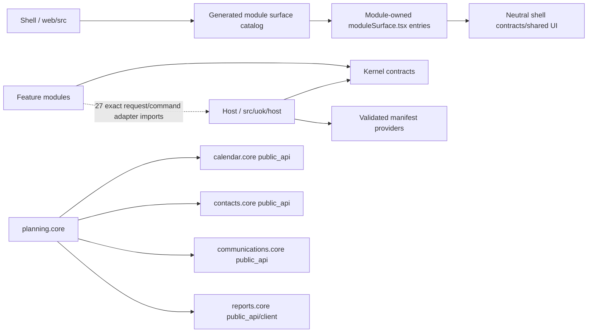

# Modular Monolith Structure Re-Audit – 2026-07-16

**Status:** Complete.

**Current candidate:** `UOK-3.1.0-alpha.3`

**Audit baseline:** `c4d9a645cbbabf39a6b558889e26e7ebf9e7caee` on `feature/planning-flow-board`.

**Scope:** Current production source, manifests, ORM mappings, migrations, public APIs, Host/Kernel composition, frontend shell/module graph, architecture tests, and current-head CI after the Gap 1–3 changes.

## 1. Executive Verdict

- **Overall rating:** Good
- **Numeric score average:** **4.25 / 5**
- **Best practical modular-monolith structure:** **Yes, for the current product scope.** Business behavior, data mappings, migrations, tests, and executable UI are owned by manifest-defined modules; Planning's foreign reads use owner DTO/query APIs; Planning and Contacts have small supported facades; Host owns application and infrastructure composition; Kernel is small and feature-independent; and the shell composes feature UI through a neutral nine-field port. The remaining defects are bounded in-process seams, internal-only SCCs, and static-analysis blind spots. None requires a domain rewrite or blocks feature delivery.
- **Change from the prior 2.3 / 5 Needs Work verdict:** the score increased by **1.95 points**. Gap 1 removed Planning's foreign ORM/table reads, Gap 2 reduced Planning from a broad implicit surface to 7 supported symbols and Contacts to 8, and Gap 3 separated Host from Kernel while removing the shell–Contacts cycle. Data ownership, public API discipline, shared-kernel minimalism, enforcement, and extractability all moved from weak/implicit to explicit/tested.

## 2. Module Inventory

Approximate size signals use nonblank production source lines. Test, verifier, migration, generated, and compiled files are excluded unless noted.

| Module | Business capability | Public API surface (count + path) | Own tables? | Depends on (public only?) | Size (Healthy / Too small / Too large) | Notes |
|---|---|---|---|---|---|---|
| **Host** (platform role) | FastAPI bootstrap, DI, engine/session/pool, auth, command dispatch, provider loading, ORM registration, router/policy/report composition | Internal composition surface under `src/uok/host`; not a feature facade | No business tables | Kernel contracts, product-neutral platform services, and validated manifest providers | Healthy | 13 Python files / about 1,212 nonblank LOC. Feature access is limited to 27 exact path-and-symbol adapter imports defined in `tests/kernel_host_backend_boundary_support.py`. |
| **Kernel** (shared-kernel role) | Stable persistence, actor/permission, command/error, and module-runtime contracts plus universal governance mappings | 4 substantive contract files under `src/uok/kernel`; 9 mappings in `src/uok/kernel_models.py` | Yes: 9 universal tables | Standard library, SQLAlchemy persistence contract, and tiny product-neutral helpers only; no Host or feature dependency | Healthy | 6 files / about 376 nonblank LOC including `kernel_models.py`. No FastAPI, Starlette, Host, or feature import. |
| **Shell** (frontend host role) | Product-neutral React workbench, navigation, shared controls, generated contracts, and module composition | 9-field `ModuleSurfaceHostContext` in `web/src/contracts/moduleSurface.ts`; generated catalog in `web/src/generated/moduleSurfaceCatalog.ts` | No | Shared/contracts/OpenAPI plus exact generated module entries | Healthy | 84 production TS/TSX files / about 14,492 nonblank LOC. Shell-specific size is acceptable because feature state and transport have been removed from it. |
| `agents.core` | Planned governed-agent runbooks, approvals, tool binding, and evidence | 0; no backend or executable frontend entry | No | None | Too small | Intentionally inert `planned` scaffold in `modules/agents.core/manifest.yaml`; not an active capability and not installable. |
| `apps.manager` | Required module lifecycle/control plane | 0 cross-module facade symbols; 1 manifest router at `modules/apps.manager/backend/uok_apps_manager/api.py`; 1 UI surface | No private mapping; scoped use of Kernel `ModuleRecord` and `EventRecord` | Kernel runtime/security ports plus exact Host request adapters | Healthy | About 353 backend + frontend LOC. Only module allowed to import lifecycle mutators. |
| `calendar.core` | Calendars, events, recurrence, reminders, free/busy, and iCalendar export | 4 symbols in `modules/calendar.core/backend/uok_calendar_core/public_api.py`; 1 UI surface; 5 privileged manifest composition providers | Yes: 4 | Kernel, exact Host adapters, no feature dependency; Planning calls only `public_api` | Healthy | About 4,820 backend + frontend LOC. `api.py`, `commands.py`, and `CalendarWorkspace.tsx` have soft size warnings but no hard violation. |
| `communications.core` | Organization-scoped K Connect thread identity, access, lifecycle, and deep links | 2 symbols in `modules/communications.core/backend/uok_communications_core/public_api.py`; 1 UI surface; 5 privileged manifest providers | Yes: 1 | Kernel and exact Host adapters; Planning calls only `public_api` | Healthy | About 595 backend + frontend LOC. Small but cohesive and independently owned. |
| `contacts.core` | Party/Contacts system of record, facts, consent, teams, groups, relationships, quality, import/export, and dedupe | 8 exact symbols in `modules/contacts.core/backend/uok_contacts_core/public_api.py`; 1 UI surface; private manifest-only model provider | Yes: 17 | Kernel and exact Host adapters; Planning calls only `resolve_party_reference` | Healthy | About 14,284 backend + frontend LOC. Large but capability-cohesive and organized under `_internal`; no evidence supports a split. |
| `planning.core` | Project planning, scheduling, resources, links, analysis, portfolio, revisions, and Gantt | 7 exact symbols in `modules/planning.core/backend/uok_planning_core/public_api.py`; 1 UI surface; private manifest-only model provider | Yes: 17 | Declared `calendar.core`; optional Contacts, Communications, Reports, and Calendar integrations use owner public APIs only | Healthy | About 20,309 backend + frontend LOC. Largest module and at the upper healthy bound, but its internal packages share the authoritative project/task schedule aggregate. |
| `reports.core` | Secure report artifact generation, verification, download, and deletion | 2 symbols in `modules/reports.core/backend/uok_reports_core/public_api.py`; 6 exports in `modules/reports.core/web/src/serverReports.ts`; 5 privileged manifest providers | Yes: 1 | Kernel and exact Host adapters; Planning uses the owner backend facade and typed frontend client | Healthy | About 557 backend + frontend LOC. Intentionally headless: no workbench surface. |

The release manifest validator confirms **7 modules**, **80 uniquely owned commands**, **90 uniquely owned events**, unique API prefixes, unique backend packages, closed extension points, and valid owned-table claims. Evidence: `src/uok/module_contract_validation.py`, all `modules/*/manifest.yaml`, and `tests/test_module_manifest_contract.py`.

## 3. Boundary Health

### Data ownership status

- The composed SQLAlchemy metadata contains **49 exact mappings**: **9 Kernel mappings** from `src/uok/kernel_models.py` and **40 feature mappings** from Calendar (4), Communications (1), Contacts (17), Planning (17), and Reports (1). `tests/test_module_model_registry.py` verifies one `Base`, exact owner class identity, deterministic registration, and owner-source origins.
- Apps Manager declares scoped use of Kernel control-plane records (`ModuleRecord:apps.manager`, `EventRecord:Module`) rather than claiming another feature's mapping. Calendar, Communications, Contacts, Planning, and Reports similarly declare scoped `CommandLog`/`EventRecord` use in their manifests.
- A production AST scan found only five feature-to-feature backend imports, all in Planning and all through owner `public_api` modules:
  - `modules/planning.core/backend/uok_planning_core/_internal/coordination/calendar_bridge.py:43`
  - `modules/planning.core/backend/uok_planning_core/_internal/coordination/link_resolver.py:122`
  - `modules/planning.core/backend/uok_planning_core/_internal/coordination/link_resolver.py:129`
  - `modules/planning.core/backend/uok_planning_core/_internal/coordination/link_resolver.py:135`
  - `modules/planning.core/backend/uok_planning_core/_internal/coordination/link_resolver.py:141`
- No feature backend imports another feature's ORM mapping, schema, repository, service, or infrastructure package. No feature migration references another feature's table. No feature production code uses `sqlalchemy.text`, `exec_driver_sql`, a foreign feature `ForeignKey`, `Base.metadata.tables`, or the retired `uok.models` compatibility registry.
- Planning participant/resource references store foreign identity as typed scalar IDs, not foreign feature FKs. Examples: `modules/planning.core/backend/uok_planning_core/_internal/persistence/planning_models.py` and `planning_resource_models.py`.
- The legacy initial baseline still contains original Contacts DDL in `migrations/001_initial_baseline.sql`; current Contacts changes are module-owned under `modules/contacts.core/migrations`. This is migration history, not current cross-module ownership.

### Public API discipline

- Planning's supported Python surface is exactly 7 symbols; Contacts is exactly 8. External private imports, facade module-object imports, unknown symbols, star imports, literal dynamic deep imports, and ORM backdoors are rejected by `tests/test_module_public_api_boundaries.py`.
- Calendar exposes 4 owner query/DTO symbols, Communications 2, and Reports 2. Current production callers use only those symbols. Their Host composition providers remain privileged manifest hooks under the owner package and are not business APIs.
- Host consumes runtime hooks from validated manifest targets. The only shell caller of module UI is `web/src/generated/moduleSurfaceCatalog.ts`; the registry at `web/src/features/modules/moduleSurfaceRegistry.tsx` consumes only the generated catalog.
- Reports' frontend transport remains owner-controlled in `modules/reports.core/web/src/serverReports.ts`. Planning's two callers are `modules/planning.core/web/src/planningExportModel.ts` and `PlanningReportExportControls.tsx`.
- Planning's optional Contacts, Communications, and Reports dependencies are lazy and operationally gated but are not declared in `manifest.yaml`, because the current manifest schema models required dependencies only. This is an extraction/discoverability residual, not a facade bypass.

### Dependency directions

The feature dependency direction is one-way. Host-to-module loading is composition-time and manifest-driven; module-to-Host edges are exact transport/DI seams, not domain dependencies.

### Cycles / SCCs

- **Backend graph:** 233 production Python modules, 871 resolved source edges, 225 SCCs, and 3 non-singleton SCCs.
  1. A 6-file product-neutral Host/platform validation SCC spans `src/uok/host/module_imports.py`, `src/uok/host/module_paths.py`, `src/uok/module_contract_rules.py`, `src/uok/module_contract_validation.py`, `src/uok/module_lifecycle_policy.py`, and `src/uok/module_manifest_loader.py`.
  2. A 3-file Contacts-internal import SCC spans `guided_import.py`, `guided_import_support.py`, and `import_commands.py` under `_internal/exchange_quality`.
  3. A 2-file Planning-backend SCC spans `_internal/scheduling/baselines.py` and `read_model.py`.
- **Frontend graph:** 291 production TS/TSX files, 921 resolved source edges, 290 SCCs, and one non-singleton SCC: `modules/planning.core/web/src/planningApi.ts` ↔ `planningApiErrors.ts`. The reverse edge is type-only.
- **Cross-business-owner SCCs:** **Zero** in backend and frontend.
- **Shell/feature SCCs:** **Zero**.
- **Kernel/feature or Kernel/Host SCCs:** **Zero**.

### Forbidden dependency hits

**None.** The current architecture tests report no forbidden imports, no unsupported facade members, no unallowlisted Host symbols, no transitive feature-to-Host paths outside the documented adapter seams, and no shell/module backedge.

## 4. Kernel & Host Assessment

### Kernel

The formal Kernel is appropriately small:

- `src/uok/kernel/persistence.py` — single declarative `Base`;
- `src/uok/kernel/security.py` — immutable `Actor` plus permission-policy port;
- `src/uok/kernel/command_contracts.py` — transport-neutral command keys, limits, and error contracts;
- `src/uok/kernel/module_runtime.py` — host-configured module lifecycle/catalog port;
- `src/uok/kernel_models.py` — 9 universal organization, identity, governance, lifecycle, command-log, workflow, and event mappings.

`tests/test_kernel_host_backend_boundaries.py` verifies that Kernel imports no FastAPI, Starlette, Host, or feature package. SQLAlchemy appears only in the persistence contract and universal mappings. Recommendation: **keep** the Kernel at this scope; additions require an explicit cross-module invariant and an ADR.

### Host

Host responsibility is complete:

- application/lifespan/static/global router composition: `src/uok/host/application.py`;
- engine/session/pool/request dependency: `database.py`, `db_pool.py`;
- token parsing and actor request dependency: `security.py`;
- command persistence and dispatch: `commands.py`, `module_commands.py`;
- validated provider import and backend paths: `module_imports.py`, `module_paths.py`;
- model registration: `model_registry.py`;
- router, policy, dashboard, and evidence composition: `module_routers.py`, `module_policy.py`, `module_reports.py`.

Only 12 documented HTTP adapters may import `get_db` and `current_actor`, and only 3 documented command adapters may import `execute_command`: **27 exact path-and-symbol imports** in total. The allowlist and transitive dependency checks are in `tests/kernel_host_backend_boundary_support.py` and `tests/test_kernel_host_backend_boundaries.py`.

Product-neutral platform services still exist directly under `src/uok` and `src/uok/api`. They are not feature code and features cannot reach Host through them, but the six-file Host/platform SCC shows that the namespace is not a perfectly acyclic layered platform. This is maintainability debt, not a modular-boundary failure.

### ADR-0028 alignment

ADR-0028 is **implemented as written**:

- Host owns bootstrap, DI, ORM registration, auth, command dispatch, and provider composition.
- Kernel exposes stable ports/contracts and universal mappings without feature dependencies.
- Host configures runtime and security ports once; unconfigured direct use fails explicitly in `tests/test_module_runtime_port.py`.
- Lifecycle mutation wrappers are limited to Apps Manager.
- Module-owned mappings use the single Kernel `Base` and are loaded only by the Host model registry.
- Retired global ORM/composition compatibility modules are absent.
- The shell port is neutral, Contacts owns its frontend behavior, and the generated catalog is the sole shell importer of exact module surfaces.
- Architecture tests enforce the declared rules.

The only alignment nuance is physical: several product-neutral contract-validation and lifecycle helpers remain at `src/uok/*.py` rather than being named Host or Kernel. The freeze therefore forbids new arbitrary root-level shared code and requires new shared contracts to be classified deliberately.

## 5. Shell & Frontend Boundaries

- `web/src/contracts/moduleSurface.ts` defines a nine-field `ModuleSurfaceHostContext` with token, role, appearance, read-only module rows, busy action, lifecycle action, host refresh, refresh revision, and unauthorized callback. It imports no Workbench implementation, generated runtime catalog, or feature code.
- `web/src/generated/moduleSurfaceCatalog.ts` is the only shell file that imports feature entries. It imports exactly five canonical `moduleSurface.tsx` files for Apps Manager, Calendar, Communications, Contacts, and Planning.
- Feature source may import only shell-neutral `@uok/contracts/*`, `@uok/shared/*`, or generated OpenAPI declarations. `tests/test_kernel_host_shell_boundaries.py` rejects shell app/features/catalog imports from modules.
- Contacts owns its HTTP reads, DTOs, filters, preferences, storage keys, commands, workspace state, and root below `modules/contacts.core/web/src`. The shell keeps visited roots mounted generically, advances the refresh revision, and clears host-scoped state on a module-reported 401 without importing Contacts behavior.
- Reports is intentionally headless. Planning's Reports client dependency is one-way and owner-controlled.
- **Remaining shell ↔ feature cycles:** none.
- **Neutral contract health:** healthy and appropriately small. Adding a field requires a real cross-module host capability, contract tests, generated catalog validation where applicable, and ADR/freeze review.

## 6. Enforcement Scorecard

### Architecture tests executed during this re-audit

| Test file | Tests | Result | Primary protection |
|---|---:|---|---|
| `tests/test_planning_data_boundary.py` | 12 | Pass | Planning owner-only DTO/query imports |
| `tests/test_module_public_api_boundaries.py` | 6 | Pass | Exact Planning/Contacts facades and frontend entries |
| `tests/test_kernel_host_backend_boundaries.py` | 7 | Pass | Kernel purity, exact Host adapters, transitive Host reachability |
| `tests/test_kernel_host_shell_boundaries.py` | 5 | Pass | Neutral module ports, shell/module imports, frontend SCCs |
| `tests/test_module_runtime_port.py` | 3 | Pass | Host-only runtime/security configuration |
| `tests/test_module_physical_boundaries.py` | 7 | Pass | Physical packages and manifest-driven composition |
| `tests/test_module_model_registry.py` | 18 | Pass | 49 exact mappings, owner origins, one `Base` |
| `tests/test_module_model_claim_contract.py` | 11 | Pass | Unique feature claims and Kernel-scope protection |
| `tests/test_module_manifest_contract.py` | 24 | Pass | Closed manifest schema and lifecycle/dependency rules |
| `tests/test_module_startup_boundaries.py` | 12 | Pass | Provider origin and startup path safety |
| `tests/test_module_router_path_safety.py` | 8 | Pass | Router import/path ownership |
| `tests/test_module_api_prefix_contract.py` | 19 | Pass | Unique canonical API prefixes |
| `tests/test_frontend_module_manifest_contract.py` | 6 | Pass | Canonical module web entries and sections |
| `tests/test_frontend_module_catalog.py` | 3 | Pass | Deterministic generated surface composition |
| `tests/test_frontend_source_policy.py` | 2 | Pass | Durable typed frontend source placement |
| `tests/test_repository_dependency_and_contract_policy.py` | 7 | Pass | Dependency and generated-contract policy |
| `tests/test_naming_policy.py` | 1 | Pass | Product-neutral naming boundary |

**Expanded architecture result:** **151 / 151 passed.**

Additional current checks:

| Check | Result |
|---|---|
| `python scripts/quality_audit.py` | Pass; only soft size/function warnings |
| `validate_module_release_contracts()` | Pass; 7 modules, 80 commands, 90 events, no violations |
| `python scripts/run_python_tests.py --check` | Pass; 117 unique Python test files discovered |
| `npm --prefix web run check:contracts` | Pass; OpenAPI declarations and module catalog match runtime/manifest truth |

### Current-head CI

Both GitHub workflows for `c4d9a64` passed: [push run 29519178414](https://github.com/Soyuz-Tec/UOK/actions/runs/29519178414) and [pull-request run 29519182455](https://github.com/Soyuz-Tec/UOK/actions/runs/29519182455). The enforced workflow is `.github/workflows/uok-ci.yml`.

| CI check | Result |
|---|---|
| Validate repository policy | Pass |
| Audit Python runtime dependencies | Pass |
| Audit Python development dependencies | Pass |
| Compile Python | Pass |
| Generate engineering evidence | Pass |
| Validate module release contract | Pass |
| Check source-size guardrail | Pass |
| Run all 117 Python test files with repository runner | Pass |
| Verify database connection-capacity policy | Pass |
| Verify PostgreSQL 18 initial baseline, migrations, runtime contract, and source boundary | Pass |
| Validate manifest-declared module assets | Pass |
| Check generated API/module catalog drift | Pass |
| Audit frontend dependencies | Pass |
| Run frontend tests | Pass |
| Build static frontend | Pass |
| Build OCI image without publishing | Pass |

### Missing gates worth adding

1. Generalize the exact public-facade/private-import rule from Planning and Contacts to every executable module, with explicit privileged manifest-hook exceptions.
2. Add a repository-wide foreign-table/raw-SQL/foreign-FK ownership scan and a cross-owner backend SCC assertion.
3. Replace or supplement regex/literal import scanning with Python/TypeScript parser or compiler-based dependency analysis for computed imports, custom loaders, and unusual syntax.

## 7. Gap Closure Checklist

| Gap | Closed? | Evidence paths | Residual |
|---|---|---|---|
| 1 Planning foreign ORM | **Yes** | `tests/test_planning_data_boundary.py`; `modules/planning.core/backend/uok_planning_core/_internal/coordination/link_resolver.py`; `calendar_bridge.py`; owner `public_api.py` files | Owner APIs are in-process and accept shared `Session`/`Actor`; raw SQL and computed-import detection are not yet generic. |
| 2 Planning/Contacts size & surface | **Yes** | `modules/planning.core/backend/uok_planning_core/public_api.py`; `modules/contacts.core/backend/uok_contacts_core/public_api.py`; both `_internal` trees; `tests/test_module_public_api_boundaries.py` | Both capabilities remain large; soft file-size warnings and internal refactors should be handled only when touched. No split is justified. |
| 3 Kernel/host/shell cycles | **Yes** | `src/uok/host`; `src/uok/kernel`; `web/src/contracts/moduleSurface.ts`; `web/src/generated/moduleSurfaceCatalog.ts`; ADR-0028; Kernel/Host/Shell tests | Exact Host adapter seams remain; one Host/platform SCC and owner-internal Contacts/Planning SCCs remain; no cross-feature or shell/feature SCC exists. |

## 8. Best-Structure Scorecard (1–5 each)

| Dimension | Score | Justification |
|---|---:|---|
| Module boundaries by business capability | 5 | All active feature behavior, data, UI, migrations, tests, and verifiers are physically module-owned; no cross-business SCC exists. |
| Module size health | 4 | Planning and Contacts are large but internally capability-organized and aggregate-cohesive; soft review warnings remain. |
| Data ownership isolation | 5 | 40 feature mappings have exact owners; no foreign ORM import, feature FK, migration reference, raw SQL access, or cross-module join was found. |
| Public API discipline | 4 | Current callers use narrow DTO/query/facade surfaces; exact enforcement is strongest for Planning/Contacts and is not yet manifest-derived for every module. |
| Shared kernel minimalism | 4 | Kernel is 376 nonblank LOC with stable ports and 9 universal mappings; root platform helpers and a Host/platform SCC remain outside the formal Kernel. |
| Cross-module communication quality | 4 | Owner DTO APIs, typed frontend clients, and neutral UI ports dominate; shared Session/Actor, optional undeclared providers, and exact Host adapters remain. |
| Architecture enforcement | 4 | 151 architecture tests plus CI, manifest, model, SCC, contract, and quality gates are strong; raw SQL/computed import/all-module facade blind spots remain. |
| Extractability readiness | 4 | Feature domain/data/UI ownership is strong; extraction needs transport, unit-of-work, actor, command-bus, and database adapters rather than domain rewrites. |

**Average: 4.25 / 5.** The structure is good enough to freeze and build on. It is not rated Excellent because the monolith still uses a shared SQLAlchemy unit of work and metadata graph, exact Host adapter seams, internal platform/feature SCCs, and incomplete generic enforcement for every possible import/SQL form.

## 9. Residual Risks (prioritized)

1. **Accept — In-process Host adapter seams.** Twenty-seven exact imports expose `get_db`, `current_actor`, or `execute_command` only to documented HTTP/command adapters. They are tested transport seams. Extraction replaces them with unit-of-work, actor-context, and command-bus adapters; domain code need not be rewritten.
2. **Fix later — Host/platform validation SCC and grandfathered root helpers.** The six-file SCC is product-neutral and unreachable from feature code outside permitted ports, but it weakens platform layering. Do not run a cosmetic move now; break it when manifest/provider work next changes these files.
3. **Accept — Owner-internal SCCs.** Contacts has one three-file guided-import SCC; Planning has one two-file backend SCC and one two-file frontend SCC. None crosses a feature, Host, Kernel, or shell boundary. Refactor only when the owning capability is modified or the cycle causes review/test friction.
4. **Fix later — Raw SQL, reflection, and computed import blind spots.** Current tests are strong for static/literal imports and mapped ownership but cannot prove arbitrary constructed imports, custom loaders, reflective metadata access, or foreign table names embedded in raw SQL. No current hit was found.
5. **Fix later — Uneven all-module facade enforcement and optional dependency declaration.** Calendar, Communications, and Reports are clean today, but the generic private-import test is hardcoded to Planning/Contacts. Planning's optional provider dependencies are also not manifest-declared. Address these when the next cross-module integration or manifest schema change is introduced.

**Fix now (P0): none.**

## 10. Architecture Freeze Rules

The canonical freeze is `docs/architecture/ARCHITECTURE-FREEZE-2026-07-16.md`. Until an intentional unfreeze ADR is accepted:

1. **Code location is owner-driven.**
   - Application bootstrap, FastAPI/SQLAlchemy infrastructure, authentication transport, command dispatch, provider resolution, and composition live in `src/uok/host`.
   - Only stable feature-neutral ports/contracts and universal governance mappings may live in `src/uok/kernel` or `src/uok/kernel_models.py`.
   - Business behavior, ORM mappings, migrations, permissions, commands/events, tests, verifiers, and feature UI live under `modules/<module_name>`.
   - Product-neutral shell orchestration and shared primitives live under `web/src`; module-specific state, DTOs, transport, commands, CSS, and UI live under the owning module.
   - Existing product-neutral root `src/uok/*.py` helpers are grandfathered. Do not add a new arbitrary root shared service; classify it as Host, Kernel, or owner module.
2. **Public API changes are controlled.**
   - External callers use only the owning module's `public_api.py`, canonical `moduleSurface.tsx`, or documented owner frontend client.
   - New public symbols require a demonstrated external caller, immutable/serialization-safe DTOs, exact allowlist/test updates, and owning-module documentation.
   - ORM mappings, SQLAlchemy expressions, repository/session factories, shell implementation objects, and mutable domain entities must not cross a public boundary.
3. **Foreign data access is prohibited.**
   - No module may import another module's ORM, schema, repository, service, `_internal`, migration, or infrastructure package.
   - No foreign table SQL, cross-feature FK, cross-module join, shared write table, reflective metadata lookup, or compatibility registry is allowed.
   - Cross-module reads and commands go through owner APIs, typed clients, or explicit events/read models. Tenant, authorization, lifecycle, and audit checks stay in the owner.
4. **New modules require a complete capability boundary.**
   - Add `README.md`, closed `manifest.yaml`, backend/web/migrations/tests ownership folders, unique API prefix, commands/events/permissions, owned-table declarations, narrow public API, candidate verifier when runtime-proven, and architecture tests.
   - A planned module remains inert. An executable module must own one clear business capability and must not require direct edits inside another feature.
5. **Splits are evidence-gated.**
   - Split only when a second capability has independent business language, its own aggregate/table ownership, a distinct stable API, independent lifecycle/permissions, and enough autonomous complexity.
   - Do not split merely for LOC. Do not create a boundary that requires chatty calls, foreign ORM access, or a distributed transaction across the former aggregate.
   - A split requires an ADR, ownership/migration plan, compatibility plan, and extraction-style contract tests.
6. **Dependency direction is frozen.**
   - Feature modules may depend on Kernel contracts, exact documented Host adapters, owner public APIs, and neutral shell/shared frontend contracts only.
   - Host may compose modules only through validated manifests.
   - Shell may import module code only through the generated exact surface catalog. New cross-owner SCCs are forbidden.
7. **Required checks before merge.**
   - Run the focused Gap 1–3 architecture suite, module manifest/model/physical boundary tests, `python scripts/quality_audit.py`, the full Python runner, generated-contract check, frontend tests/build, and affected candidate verifiers.
   - CI must be green. New modules, public symbols, Host adapter paths, Kernel contracts, or shell port fields require corresponding failing-then-passing architecture tests.

## 11. Recommended Next Actions (max 5)

1. **Structure work paused; build features on freeze.** Treat the current 4.25/5 structure as the approved baseline and stop cosmetic modularization.
2. Deliver the next tenant-scoped Party/MDM or intelligence vertical slice using `contacts.core` as the source-of-truth owner and immutable owner APIs for consumers; do not create shared tables.
3. When the next module or cross-module consumer is added, generalize the public-facade and data-ownership gates to all modules as part of that feature's acceptance criteria.
4. Add optional-provider dependency metadata only when a real integration requires manifest evolution; use an ADR and keep required vs optional semantics distinct.
5. Leave Host/platform and owner-internal SCC cleanup in the maintenance backlog until those files are touched or evidence shows review, test, or runtime cost.
